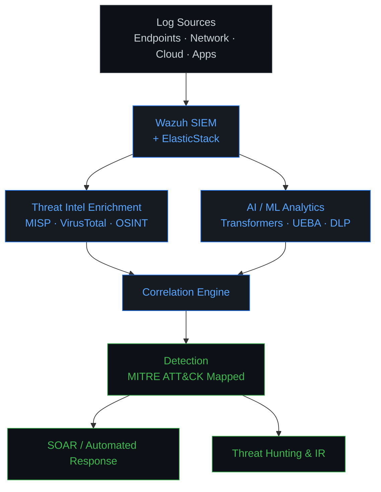

<div align="center">

# Aniqa Ayub

**Cybersecurity R&D  ·  SIEM Engineer  ·  Threat Detection Engineer  ·  AI-driven Cybersecurity**

*Designing, engineering, and researching intelligent security systems at the intersection of SIEM, threat intelligence, AI/ML, and security automation.*

[](https://cybersecurity-portfolio-blue.vercel.app/)
[](https://www.linkedin.com/in/aniqa-ayub-cybersecurity-researcher/)
[](https://github.com/ainin123)
[](mailto:aniqaayub0fficial@gmail.com)

</div>

---

## `$ whoami`

```text
NAME       : Aniqa Ayub
ROLE       : Cybersecurity R&D  /  SIEM Engineer  /  Threat Detection Engineer
SPECIALTY  : Threat Detection  &  Security Engineering
RESEARCH   : AI-driven Cybersecurity
FOCUS      : SIEM  |  Threat Intelligence  |  DLP  |  AI / ML  |  Security Automation
LOCATION   : Islamabad, Pakistan
STATUS     : Building & Researching
```

---

## About

I am a Research Associate at the **National Centre for Cyber Security (NCCS), NASTP**, where
I design and deploy enterprise-scale SIEM and threat-detection systems for critical
infrastructure. My work spans **Wazuh-based SIEM engineering, UEBA, SOAR-driven response,
threat intelligence integration, DLP / PII detection, and threat hunting** aligned to
MITRE ATT&CK, augmented by transformer-based machine learning for context-aware detection.

Alongside engineering, I conduct research on **AI-driven cybersecurity**, including
transformer ensembles for PII detection, explainable AI for content safety, and AI-based
SIEM correlation. I hold an **MS in Cybersecurity** (Air University, 2025) with a
specialization in AI-driven cybersecurity.

---

## Security Domains

```text
┌──────────────────────────────┬──────────────────────────────┐
│  SIEM & SOC Engineering      │  Threat Detection            │
│  Threat Intelligence         │  Threat Hunting              │
│  Security Automation (SOAR)  │  DLP / PII Detection         │
│  Network Security & Forensics│  AI / ML for Security        │
│  Cloud-Native Security       │  Penetration Testing (VAPT)  │
│  Detection Engineering       │  Security Research           │
└──────────────────────────────┴──────────────────────────────┘
```

---

## Technical Arsenal

**SIEM & Detection**
`Wazuh` · `ElasticStack (ELK)` · `Splunk` · `Snort IDS/IPS` · `Sysmon` · `Packetbeat`

**Threat Intelligence**
`MISP` · `Yeti` · `VirusTotal` · `Maltego` · `Shodan` · `OSINT`

**Network Security & Forensics**
`Wireshark` · `tShark` · `tcpdump`

**Vulnerability Assessment & VAPT**
`Nmap` · `Burp Suite` · `Nessus` · `OpenVAS` · `Nikto` · `Acunetix` · `Hydra` · `Cuckoo Sandbox`

**AI / Machine Learning**
`Transformers` · `BERT` · `RoBERTa` · `TensorFlow` · `PyTorch` · `spaCy` · `SHAP / XAI`

**Programming & Automation**
`Python` · `Bash` · `JavaScript` · `SQL` · `REST APIs` · `FastAPI`

**Cloud & Orchestration**
`Docker` · `Kubernetes` · `Linux`

**Security Frameworks & Standards**
`MITRE ATT&CK` · `NIST CSF` · `ISO 27001 / 27002` · `CIS Critical Security Controls` · `OWASP`

---

## Featured Security Projects

### Enterprise Wazuh SIEM Deployment for Critical Infrastructure
- **Problem:** Distributed critical infrastructure environments lacked unified, real-time
  detection across endpoint, network, and application layers.
- **Solution:** Architected and deployed an enterprise-scale Wazuh SIEM integrating
  ElasticStack, Snort IDS/IPS, Sysmon, and Packetbeat across 50+ monitored endpoints,
  with 150+ custom detection rules and decoders, multi-tenant RBAC, automated agent
  provisioning, and SOAR-driven response workflows.
- **Stack:** `Wazuh` · `ElasticStack` · `Snort` · `Sysmon` · `Packetbeat` · `SOAR` · `Python`
- **Impact:** Unified detection coverage across the environment with MITRE ATT&CK
  mapping and automated incident-response playbooks.

### AI-Powered Data Loss Prevention *(Active)*
- **Problem:** Traditional regex-based DLP misses context, generating high false-negative
  rates on modern log streams (JSON, syslog, CEF).
- **Solution:** Developing a transformer-based sensitive data classification and PII
  detection engine using fine-tuned BERT and RoBERTa, integrated into SIEM log-processing
  pipelines and tuned for low-latency inference.
- **Stack:** `BERT` · `RoBERTa` · `Transformers` · `PyTorch` · `Python` · `FastAPI`
- **Status:** In active development, targeting production integration with the SIEM layer.

### Cloud-Native SIEM Infrastructure *(In Progress)*
- **Problem:** Static SIEM deployments cannot elastically scale with unpredictable
  event volumes or infrastructure growth.
- **Solution:** Designing a containerized Wazuh deployment on Kubernetes with
  auto-scaling detection workloads, Terraform-based IaC provisioning, and integrated
  observability tooling.
- **Stack:** `Wazuh` · `Docker` · `Kubernetes` · `Terraform`
- **Target:** High-availability, distributed security monitoring architecture.

### Threat Intelligence Automation Pipeline
- **Problem:** Analysts spend disproportionate time triaging and correlating high-volume
  IOC feeds by hand.
- **Solution:** Building an automated pipeline for IOC enrichment and correlation across
  MISP, VirusTotal, and multiple external threat-intel feeds, with deduplication and
  priority scoring for triage.
- **Stack:** `MISP` · `VirusTotal` · `Python` · `REST APIs`
- **Impact:** Reduces analyst overhead in threat-intel correlation workflows.

### End-to-End Penetration Testing Engagements
- **Problem:** Client environments require full-scope assurance across network, web,
  and cloud attack surface.
- **Solution:** Delivered comprehensive VAPT engagements covering reconnaissance, active
  exploitation, privilege escalation, and post-exploitation, with CVSS-rated reporting
  and remediation guidance.
- **Stack:** `Nmap` · `Burp Suite` · `Nessus` · `OpenVAS` · `Nikto` · `Shodan`
- **Impact:** Client-facing engagement lifecycle from scoping through remediation review.

---

## Security Architecture I Work With

Representative view of the detection and response stack I engineer against. This is not a single deployed system.



---

## Research & Publications

> All manuscripts below are **submitted** or **in preparation**. None are published in a
> peer-reviewed venue at this time.

**Submitted (under review)**
- Ayub, A. (2026). *A Transformers-based Ensemble Framework for Context-Aware PII
  Detection in Modern SIEM Systems.* Manuscript submitted for publication.
- Ayub, A. (2026). *Anti-Religion Hate Speech Detection Framework Using Machine Learning
  and Explainable Artificial Intelligence.* Manuscript submitted for publication.

**In Preparation**
- Ayub, A. (2026). *Enhancement of SIEM Using AI-based Correlation.* Manuscript in preparation.

**Research Interests**

`AI-driven Cybersecurity` · `Adversarial / Robust Machine Learning` · `PII Detection` ·
`Data Loss Prevention` · `SIEM Intelligence` · `Threat Detection` · `Threat Intelligence` ·
`Security Analytics` · `Explainable AI`

---

## Security Engineering Capabilities

```text
┌──────────────────────────────────────────────┐
│  SECURITY ENGINEERING CAPABILITIES           │
├──────────────────────────────────────────────┤
│  Detection Engineering                       │
│  SIEM Architecture & Deployment              │
│  Log Enrichment & Normalization              │
│  Threat Intelligence Integration             │
│  Security Automation & SOAR Playbooks        │
│  Threat Hunting (MITRE ATT&CK mapped)        │
│  DLP / PII Detection                         │
│  AI-driven Security Analytics                │
│  Incident Response                           │
│  Network Forensics                           │
│  Vulnerability Assessment & VAPT             │
│  Cloud-Native / Containerized Deployments    │
└──────────────────────────────────────────────┘
```

---

## Security Frameworks

`MITRE ATT&CK` · `NIST Cybersecurity Framework` · `ISO 27001 / 27002` · `CIS Critical Security Controls` · `OWASP`

---

## Certifications

**Completed**
| # | Certification | Issuer |
|---|---------------|--------|
| 1 | PM Kamyaab Jawan Program in Cybersecurity, **Grade A+** | NAVTTC (2022) |
| 2 | Ethical Hacking Essentials (EHE) | EC-Council (2023) |

**In Progress**
| # | Certification | Issuer |
|---|---------------|--------|
| 1 | Certified in Cybersecurity (CC) | ISC2 |
| 2 | Certified Ethical Hacker (CEH) | EC-Council |
| 3 | CompTIA Security+ | CompTIA |

---

## Achievements

- **Presidential Award Ceremony, Aiwan-e-Sadr, Islamabad.** Invited in recognition of
  securing the top position in the batch upon completion of the PM Kamyaab Jawan Program
  in Cybersecurity.
- **Certificate of Appreciation, Air University Cyber Security Society (AUCSS)**
  for contribution and collaboration with the society team.
- **Certificate of Appreciation** as Host at the PCSC Capture the Flag (CTF) Hackathon 2025.
- **Certificate of Participation, AU Expo 2025** for demonstrating an academic research
  project to attendees, faculty, and industry representatives.

---

## Professional Experience

**Research Associate, SIEM Engineering & Threat Detection**
*National Centre for Cyber Security (NCCS), NASTP*
`Feb 2024 to Present`

- Designed and deployed an enterprise-scale **Wazuh SIEM** integrating ElasticStack,
  Snort IDS/IPS, Sysmon, and Packetbeat across 50+ monitored endpoints.
- Engineered a **UEBA** analytics layer and a multi-tenant **RBAC** governance system
  with automated agent provisioning and credential rotation.
- Implemented **SOAR** integration with automated incident-response workflows and
  playbooks for real-time remediation.
- Developed 150+ custom **Wazuh decoders and detection rules** tailored to the
  organizational threat landscape.
- Built **log enrichment pipelines** with GeoIP, asset context, and threat-intel indicators
  to improve detection fidelity and reduce triage time.
- Integrated **transformer-based ML models** into the detection layer for anomaly detection
  and context-aware event analysis.
- Developed **DLP** capabilities within the SIEM framework using AI-driven sensitive data
  classification and PII detection.
- Led **threat hunting** operations with comprehensive **MITRE ATT&CK** mapping across
  reconnaissance, initial access, persistence, privilege escalation, defense evasion,
  credential access, discovery, lateral movement, collection, and exfiltration.
- Designed **cloud-native SIEM** infrastructure using Docker and Kubernetes for scalable,
  high-availability detection.
- Delivered technical briefings and executive presentations to C-level stakeholders and
  critical infrastructure clients.

---

## Currently Working On

```text
[+] AI-powered PII detection (transformer ensemble)
[+] Intelligent SIEM correlation (AI-based)
[+] Threat intelligence automation pipeline
[+] Cloud-native SIEM architecture on Kubernetes
[+] Security automation & SOAR playbooks
[+] Threat detection & AI-security research
```

---

## GitHub Project Navigation

```text
SECURITY LAB
│
├── SIEM & Detection Engineering
├── Threat Intelligence Automation
├── DLP / PII Detection  (AI-driven)
├── AI Security Research
├── Network Security & Forensics
├── Penetration Testing (VAPT)
└── Security Automation
```

Explore pinned repositories on the profile for hands-on work across these areas.

---

## Connect

<div align="center">

[](https://cybersecurity-portfolio-blue.vercel.app/)
[](https://www.linkedin.com/in/aniqa-ayub-cybersecurity-researcher/)
[](https://github.com/ainin123)
[](mailto:aniqaayub0fficial@gmail.com)

*Member: TryHackMe · Women in CyberSecurity (WiCyS)*

</div>
