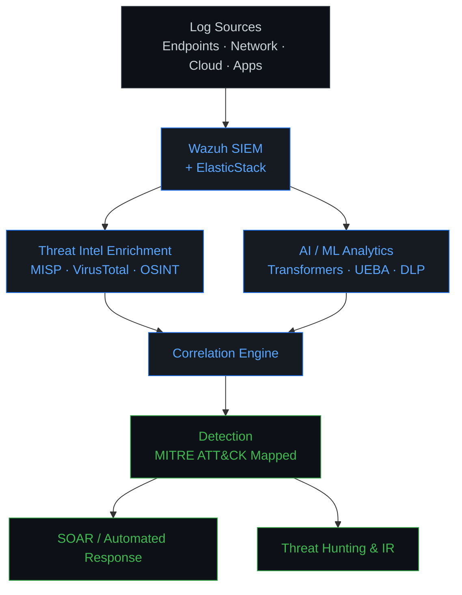

<div align="center">

# Aniqa Ayub

**Cybersecurity R&D  ·  SIEM Engineer  ·  Threat Detection Engineer  ·  AI-driven Cybersecurity**

*Designing, engineering, and researching intelligent security systems at the intersection of SIEM, threat intelligence, AI/ML, and security automation.*

[](https://cybersecurity-portfolio-blue.vercel.app/)
[](https://www.linkedin.com/in/aniqa-ayub-cybersecurity-researcher/)
[](https://github.com/ainin123)
[](mailto:aniqaayub0fficial@gmail.com)

</div>

---

## `$ whoami`

```text
NAME       : Aniqa Ayub
ROLE       : Cybersecurity R&D  /  SIEM Engineer  /  Threat Detection Engineer
SPECIALTY  : Threat Detection  &  Security Engineering
RESEARCH   : AI-driven Cybersecurity
FOCUS      : SIEM  |  Threat Intelligence  |  DLP  |  AI / ML  |  Security Automation
LOCATION   : Islamabad, Pakistan
STATUS     : Building & Researching
```

---

## About

I am a Research Associate at the **National Centre for Cyber Security (NCCS), NASTP**, where
I design and deploy enterprise-scale SIEM and threat-detection systems for critical
infrastructure. My work spans **Wazuh-based SIEM engineering, UEBA, SOAR-driven response,
threat intelligence integration, DLP / PII detection, and threat hunting** aligned to
MITRE ATT&CK, augmented by transformer-based machine learning for context-aware detection.

Alongside engineering, I conduct research on **AI-driven cybersecurity**, including
transformer ensembles for PII detection, explainable AI for content safety, and AI-based
SIEM correlation. I hold an **MS in Cybersecurity** (Air University, 2025) with a
specialization in AI-driven cybersecurity.

---

## Security Domains

```text
┌──────────────────────────────┬──────────────────────────────┐
│  SIEM & SOC Engineering      │  Threat Detection            │
│  Threat Intelligence         │  Threat Hunting              │
│  Security Automation (SOAR)  │  DLP / PII Detection         │
│  Network Security & Forensics│  AI / ML for Security        │
│  Cloud-Native Security       │  Penetration Testing (VAPT)  │
│  Detection Engineering       │  Security Research           │
└──────────────────────────────┴──────────────────────────────┘
```

---

## Technical Arsenal

**SIEM & Detection**
`Wazuh` · `ElasticStack (ELK)` · `Splunk` · `Snort IDS/IPS` · `Sysmon` · `Packetbeat`

**Threat Intelligence**
`MISP` · `Yeti` · `VirusTotal` · `Maltego` · `Shodan` · `OSINT`

**Network Security & Forensics**
`Wireshark` · `tShark` · `tcpdump`

**Vulnerability Assessment & VAPT**
`Nmap` · `Burp Suite` · `Nessus` · `OpenVAS` · `Nikto` · `Acunetix` · `Hydra` · `Cuckoo Sandbox`

**AI / Machine Learning**
`Transformers` · `BERT` · `RoBERTa` · `TensorFlow` · `PyTorch` · `spaCy` · `SHAP / XAI`

**Programming & Automation**
`Python` · `Bash` · `JavaScript` · `SQL` · `REST APIs` · `FastAPI`

**Cloud & Orchestration**
`Docker` · `Kubernetes` · `Linux`

**Security Frameworks & Standards**
`MITRE ATT&CK` · `NIST CSF` · `ISO 27001 / 27002` · `CIS Critical Security Controls` · `OWASP`

---

## Featured Security Projects

### SIEM–Threat Intelligence Platform Integration for Automated Log Enrichment
- **Problem:** Raw security events from endpoints, servers, network devices, and cloud
  services lack the contextual metadata analysts need for fast triage and response.
- **Solution:** Architected an integration where the SIEM ingests logs, forwards relevant
  indicators (IPs, domains, file hashes, URLs, emails) to a Threat Intelligence Platform,
  and receives enrichment (reputation scores, threat type, first/last seen, geolocation,
  related campaigns) back into correlation, dashboards, and alerting.
- **Flow:** `Collect  →  Enrich  →  Correlate  →  Alert  →  Respond`
- **Stack:** `SIEM` · `Threat Intelligence Platform (TIP)` · `Open-Source & Commercial Feeds` · `ISACs` · `Malware Repositories`
- **Impact:** Faster incident detection, richer alert context, and reduced analyst triage time.

### Integrated ML-Based PII Leakage Detection with SIEM
- **Problem:** Sensitive PII embedded in unstructured PDF documents evades traditional DLP
  controls and remains a common source of data leakage.
- **Solution:** Designed and deployed an automated ML system that integrates with the SIEM
  to detect and alert on PII inside PDF files in real time. A spaCy NLP model runs on a
  Linux-based agent, scans documents via PyMuPDF (fitz), and is orchestrated through
  File Integrity Monitoring (FIM) pathways with custom JSON log extraction that raises
  Level 10 SIEM alerts on detection.
- **Evaluation:** End-to-end evaluation script using scikit-learn and Pandas computes
  multi-label Precision, Recall, and F1 against ground-truth data for continuous accuracy
  monitoring.
- **Optimization:** Logs events only when PII is detected, significantly lowering alert
  fatigue and storage overhead.
- **Stack:** `spaCy` · `PyMuPDF (fitz)` · `scikit-learn` · `Pandas` · `Python` · `Linux` · `SIEM` · `FIM`
- **Impact:** Real-time, context-aware DLP for unstructured documents with a measurable
  accuracy feedback loop.

### SIEM–SOAR Integration for Automated Incident Response
- **Problem:** Detection, investigation, and response are often handled as separate
  processes, slowing time-to-containment.
- **Solution:** Integrated a SIEM with a SOAR platform to create a feedback-driven
  security workflow. The SIEM continuously ingests events from endpoints, servers,
  network devices, applications, and cloud environments; when suspicious activity is
  detected it forwards the alert to SOAR, which runs automated playbooks to investigate,
  enrich, prioritize, and respond, with analyst approval where required.
- **Playbook use cases:** threat-intelligence lookups, indicator analysis, endpoint
  containment, account protection, notifications, and escalation.
- **Flow:** `Data Sources  →  SIEM  →  Alerts  →  SOAR  →  Investigation & Enrichment  →  Automated Response  →  Incident Closure`
- **Stack:** `SIEM` · `SOAR` · `Automated Playbooks`
- **Impact:** Connects detection, investigation, response, and monitoring into one
  continuous workflow.

### Blackbox Penetration Testing of a Web Application *(Air University)*
- **Scope:** Comprehensive, non-interactive external reconnaissance and vulnerability
  assessment of a target website, without direct interaction with the target.
- **Techniques:** Subdomain and portal enumeration, web-technology fingerprinting, network
  range and subnet mapping, OSINT email and social-media correlation, breach-data
  investigation, company organogram construction, LinkedIn workforce enumeration,
  confidential-document discovery, endpoint / operating-system / installed-software
  fingerprinting, printer and open-port identification, and passive vulnerability
  assessment.
- **Deliverable:** A comprehensive analysis report documenting all findings.
- **Stack:** `OSINT` · `Google Hacking` · `Passive Reconnaissance` · `Web Application Security Assessment`

---

## Security Architecture I Work With

Representative view of the detection and response stack I engineer against. This is not a single deployed system.



---

## Research & Publications

> All manuscripts below are **submitted** or **in preparation**. None are published in a
> peer-reviewed venue at this time.

**Submitted (under review)**
- Ayub, A. (2026). *A Transformers-based Ensemble Framework for Context-Aware PII
  Detection in Modern SIEM Systems.* Manuscript submitted for publication.
- Ayub, A. (2026). *Anti-Religion Hate Speech Detection Framework Using Machine Learning
  and Explainable Artificial Intelligence.* Manuscript submitted for publication.

**In Preparation**
- Ayub, A. (2026). *Enhancement of SIEM Using AI-based Correlation.* Manuscript in preparation.

**Research Interests**

`AI-driven Cybersecurity` · `Adversarial / Robust Machine Learning` · `PII Detection` ·
`Data Loss Prevention` · `SIEM Intelligence` · `Threat Detection` · `Threat Intelligence` ·
`Security Analytics` · `Explainable AI`

---

## Security Engineering Capabilities

```text
┌──────────────────────────────────────────────┐
│  SECURITY ENGINEERING CAPABILITIES           │
├──────────────────────────────────────────────┤
│  Detection Engineering                       │
│  SIEM Architecture & Deployment              │
│  Log Enrichment & Normalization              │
│  Threat Intelligence Integration             │
│  Security Automation & SOAR Playbooks        │
│  Threat Hunting (MITRE ATT&CK mapped)        │
│  DLP / PII Detection                         │
│  AI-driven Security Analytics                │
│  Incident Response                           │
│  Network Forensics                           │
│  Vulnerability Assessment & VAPT             │
│  Cloud-Native / Containerized Deployments    │
└──────────────────────────────────────────────┘
```

---

## Security Frameworks

`MITRE ATT&CK` · `NIST Cybersecurity Framework` · `ISO 27001 / 27002` · `CIS Critical Security Controls` · `OWASP`

---

## Certifications

**Completed**
| # | Certification | Issuer |
|---|---------------|--------|
| 1 | PM Kamyaab Jawan Program in Cybersecurity, **Grade A+** | NAVTTC (2022) |
| 2 | Ethical Hacking Essentials (EHE) | EC-Council (2023) |

**In Progress**
| # | Certification | Issuer |
|---|---------------|--------|
| 1 | Certified in Cybersecurity (CC) | ISC2 |
| 2 | Certified Ethical Hacker (CEH) | EC-Council |
| 3 | CompTIA Security+ | CompTIA |

---

## Achievements

- **Presidential Award Ceremony, Aiwan-e-Sadr, Islamabad.** Invited in recognition of
  securing the top position in the batch upon completion of the PM Kamyaab Jawan Program
  in Cybersecurity.
- **Certificate of Appreciation, Air University Cyber Security Society (AUCSS)**
  for contribution and collaboration with the society team.
- **Certificate of Appreciation** as Host at the PCSC Capture the Flag (CTF) Hackathon 2025.
- **Certificate of Participation, AU Expo 2025** for demonstrating an academic research
  project to attendees, faculty, and industry representatives.

---

## Professional Experience

**Research Associate, SIEM Engineering & Threat Detection**
*National Centre for Cyber Security (NCCS), NASTP*
`Feb 2024 to Present`

- Designed and deployed an enterprise-scale **Wazuh SIEM** integrating ElasticStack,
  Snort IDS/IPS, Sysmon, and Packetbeat across 50+ monitored endpoints.
- Engineered a **UEBA** analytics layer and a multi-tenant **RBAC** governance system
  with automated agent provisioning and credential rotation.
- Implemented **SOAR** integration with automated incident-response workflows and
  playbooks for real-time remediation.
- Developed 150+ custom **Wazuh decoders and detection rules** tailored to the
  organizational threat landscape.
- Built **log enrichment pipelines** with GeoIP, asset context, and threat-intel indicators
  to improve detection fidelity and reduce triage time.
- Integrated **transformer-based ML models** into the detection layer for anomaly detection
  and context-aware event analysis.
- Developed **DLP** capabilities within the SIEM framework using AI-driven sensitive data
  classification and PII detection.
- Led **threat hunting** operations with comprehensive **MITRE ATT&CK** mapping across
  reconnaissance, initial access, persistence, privilege escalation, defense evasion,
  credential access, discovery, lateral movement, collection, and exfiltration.
- Designed **cloud-native SIEM** infrastructure using Docker and Kubernetes for scalable,
  high-availability detection.
- Delivered technical briefings and executive presentations to C-level stakeholders and
  critical infrastructure clients.

---

## Currently Working On

```text
[+] AI-powered PII detection (transformer ensemble)
[+] Intelligent SIEM correlation (AI-based)
[+] Threat intelligence automation pipeline
[+] Cloud-native SIEM architecture on Kubernetes
[+] Security automation & SOAR playbooks
[+] Threat detection & AI-security research
```

---

## GitHub Project Navigation

```text
SECURITY LAB
│
├── SIEM & Detection Engineering
├── Threat Intelligence Automation
├── DLP / PII Detection  (AI-driven)
├── AI Security Research
├── Network Security & Forensics
├── Penetration Testing (VAPT)
└── Security Automation
```

Explore pinned repositories on the profile for hands-on work across these areas.

---

## Connect

<div align="center">

[](https://cybersecurity-portfolio-blue.vercel.app/)
[](https://www.linkedin.com/in/aniqa-ayub-cybersecurity-researcher/)
[](https://github.com/ainin123)
[](mailto:aniqaayub0fficial@gmail.com)

*Member: TryHackMe · Women in CyberSecurity (WiCyS)*

</div>
